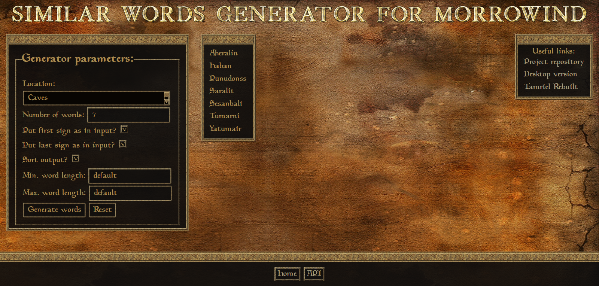

# Similar Words Generator web application

Web application for Morrowind Similar Words Generator.

## Description

It is a project made with Spring Boot and Maven. The application allows to generate words from pre-defined seeds.

## Installation

Build with Maven. Use Similar Words Generator library io.github.wsz82:similar-words-generator:1.2

## Usage

Seeds to generate words are included in project.

## Contributing
Pull requests are welcome. For major changes, please open an issue first to discuss what you would like to change.

Please make sure to update tests as appropriate.

## License
[MIT](https://choosealicense.com/licenses/mit/)